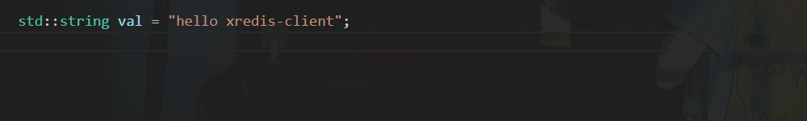

# xredis-client

<div align="center">
    <p>
        <span style="color: #8b949e; font-size: 0.95em; letter-spacing: 0.5px; line-height: 1.5;">
        <i>The next-generation, ultra-fast asynchronous C++20 Redis client library built entirely on stackless coroutines.</i>
        </span>
    </p>

    
  <p>
    
  </p> 
</div>

---
<div align="center">
  <p>
    <a href="https://opensource.org/licenses/MIT"></a>
    <a href="https://en.cppreference.com/w/cpp/20"></a>
    <a href="https://en.cppreference.com/w/cpp/compiler_support"></a>
  </p>
  | <a href="./README.md">English</a> | 
   <a href="./README_zh.md">简体中文</a> |
   <p></p> 
</div>

`xredis-client` is a redis client library built to provides user-friendly c++20 co_await API and handle high-throughput workloads. It provides features across multiple dimensions:

- **[Expressive & Elegant DSL](#QS)**: Write Redis pipelines and transactions with the simplicity of scripting languages
- **[Easy to integrate](#installation)**: Drag *\*header-only\** files to your project and then you are ready to go!

- **[Ultra Performance](#PT)**: Driven by custom `io_uring`, zero-overhead template metaprogramming and **auto command pipeline** with ring buffer, `xredis-client` do not sacrifice performance for user-friendly API. See [performance testing](#PT) here.

- **Comprehensive Redis Protocol Support**: Full support for Redis 6.0+ RESP2/RESP3 protocols, TLS, including automated, transparent `MOVED` / `ASK` routing for Redis Cluster. Type-safe co-await result.

- **[Thread-Safe & Scalable Architecture](#transparent-switch-between-redisclient-standalone-and-rediscluster)**: Seamlessly toggle between single-threaded (high-performance) and multi-threaded (shared-instance) modes via template parameters. No code changes required.

- **[Pure Asynchronous Blueprint](#understanding-concurrency-models)**: A completely non-blocking command interface engineered for high-concurrency scenarios.

<a id="QS"></a>
## 🚀 Quick Start

With `xredis-client`, modern C++ feels as natural and expressive.

+ *Pipelining & Transactions (MULTI/EXEC)*
```cpp
using xredis::RedisValue;
using Redis = xredis::RedisClient<>;

xnet::task<> func(Redis& redis){
    std::string val2 = "hello xredis-client";
    auto [_1, _2, _3, exec_res] = co_await redis.multi()
                                                .set("user:{1001}", "val1")
                                                .set("item:{1001}", val2)
                                                .exec();
                                                // hash tag {...} for cluster mode
    if(exec_res.is_error()){
        std::cout << exec_res.as_error() << std::endl;
    }
    auto& arr = exec_res.as<RedisValue::array_t>(); // std::vector<RedisValue>
    co_return;
}
```
+ *Lazy Pipeline Building (Conditional Chaining)*:
```cpp
xnet::task<> func(Redis& redis){
    auto pipe = redis.get("xredis");    // start a lazy pipe until co_await

    if(/* your logic here*/){
        co_await pipe.mset("user:{1001}", "xredis-client", "item:{1001}", "val");
    }
    else{
        auto pipe2 = pipe.get("user:{1001}");
        auto [get1, get2] = co_await pipe2;
    }
    co_return;
}
```

## Installation
Environment settings:
- Linux kernel **5.15+** (Recommended 5.17+)
- `liburing-dev` >= 2.0
- A C++20 compiler
- OpenSSL >= 1.1.0 and Linux KTLS if enabling TLS with macro `XREDIS_ENABLE_TLS`
```cpp
#define XREDIS_ENABLE_TLS
```

---
1. #### Header-Only (Recommended Way)

Simply download the required headers and include them in your project:

```bash
wget https://raw.githubusercontent.com/FAF-D2/xredis-client/master/header-only/xnet.hpp

wget https://raw.githubusercontent.com/FAF-D2/xredis-client/master/header-only/xredis-client.hpp
```
if liburing is not installed:
```bash
sudo apt install liburing-dev
```

copy this to test.cpp and change the include path

```cpp
#include"xnet.hpp"
#include"xredis-client.hpp"
#include<iostream>
using Redis = xredis::RedisClient<>;

xnet::task<int> some_task(){
    std::cout << "your task here" << std::endl;
    co_return 12345;
}

xnet::detached_task coro_main(Redis& redis){
    std::cout << "hello xredis-client!" << std::endl;
    co_await redis.context().yield();
    co_await some_task();
    // xnet::fire(some_task()); // or spawn it
    std::cout << "coro main done" << std::endl;
    redis.close();
    co_return;
}

int main(){
    xnet::io_context ctx;
    Redis redis(ctx);

    coro_main(redis); // spawn task
    
    std::cout << "ctx run" << std::endl;
    ctx.run_until_complete();
    std::cout << "exit" << std::endl;
    return 0;
}
```

compile and run:

```bash
g++ test.cpp -O2 -std=c++20 -luring -o test && ./test

### hello xredis-client!
### ctx run
### your task here
### coro main done
### exit
```

2. #### Or build from source

`xredis-client` is built heavily upon template so using header-only is recommended. However, if you prefer to manage it via CMake, you can build it from source.

```bash
git clone https://github.com/FAF-D2/xredis-client.git

cd xredis-client

mkdir build && cd build

cmake .. -DCMAKE_BUILD_TYPE=Release && make -j
```

After building, you can use the library in your own project's CMakeLists.txt:
```cmake
add_subdirectory(path/to/xredis-client)

add_executable(my_app main.cpp)
# Link the library
target_link_libraries(my_app PRIVATE xredis-client)
```

Run the test, open redis server at localhost:6379:
```bash
ctest --output-on-failure
```

Use it in your C++ code
```cpp
#include"xredis-client.hpp" // umbrella header file

int main(){
    return 0;
}
```

3. #### TLS Support

if you need TLS for communicating with Redis, you should install Openssl >= 1.1.0 and enabling KTLS:
- OpenSSL: Version 1.1.0 or higher.
- KTLS: Ensure your kernel supports KTLS and the module is loaded:
```bash
sudo apt install libssl-dev
sudo modprobe ktls
lsmod | grep ktls
```
Depending on your integration method, enable TLS as follows:
- For Header-only:

```cpp
#define XREDIS_ENABLE_TLS
#include "xredis-client.hpp"
```

- For CMake Builds:
```cmake
cmake .. -DXREDIS_ENABLE_TLS=ON
```

<a id="PT"></a>
# 🐎 Performance Testing
Despite the user-friendly API interface, `xredis-client` is efficient and ready to serve for high-performance application as well!

Below is a comparison between `xredis-client`, `boost-redis`, `go-redis` under high-concurrency workloads. The code is under directory [benchmark](./benchmark/)

Scenario:
256 bytes key-value pair with 10k concurrent coroutines requesting get() at the same time in localhost

*(10k coroutines await get())* 
| Library | Average Latency | Total Duration | Throughput | API simplicity |
|--------|------|-------|--------|--------|
| **xredis-client** | **~1.2 µs** | **12.49 ms** | **~800,000 ops/s** | Simple |
| Boost.Redis | ~2.0 µs | 20.68 ms | ~483,000 ops/s | Medium |
| go-redis | ~15 µs | 1.5 s | ~66,622 ops/s | Simple |

# More examples
The Full document can be found here: [API doc](./docs/API.md)

### Connection to Redis

Once connected, the redis client will handle disconnected and try to connect the Redis server automatically, so you might co_await `connect()` just once and handle the error

```cpp
xnet::detached_task coro_main(Redis& redis) noexcept{
    xredis::ConnectionOption option;
    option.ip = "127.0.0.1";        // ip string, domain like "www.example.com" is not supported
    option.port = 6379;             // port uint16_t
    option.username = "default";    // AUTH USERNAME PASSWORD
    option.password = "any";        // AUTH PASSWORD
    option.clientname = "D2";       // SET CLIENTNAME YOUR_NAME
    option.db = 0;                  // default 0
    option.resp = 3;                // 2 or 3, default 3

#ifdef XREDIS_ENABLE_TLS
    option.tls.cacert = "../tls/ca.crt";
    option.tls.cert   = "../tls/client.crt";
    option.tls.key    = "../tls/client.key";
    option.tls.sni    = "localhost";
#endif

    xnet::io_result<bool> result = co_await redis.connect(option);
    if(result.err){
        printf("error: %d\n", result.err);
        co_return;
    }
    else{
        printf("connect success\n");
    }

    // spwan tasks
    // ... 
    // ...
    // wating tasks for completing or while true

    redis.close();
    // should close at the [end]
    // otherwise, the ctx.run_until_complete() wouldn't stop forever
    // do not call this function when co_awaiting other operation under multi-threadings
    // see API docs for more details
}
```
---

### Transparent Switch between RedisClient standalone and RedisCluster. 

Most of API interface will stay in the same except the operations without key. The `MOVED`/`ASK` Error will be handled automatically within the class. So you just need to write as follows:

```cpp
constexpr bool shared_between_threads = false; // if the Redis shared
constexpr size_t ring_buffer_size = 4096; // the maximum inflight operations before it returns

// using Redis = xredis::RedisClient<shared_between_threads, ring_buffer_size>;
using Redis = xredis::RedisCluster<shared_between_threads, ring_buffer_size>;

xnet::task<> func(Redis& redis){
    co_await redis.set("key").get("key2"); // no need for any changes
}

```
---

### Type-safe Result and Convenient Accessors for debugging
The result of `co_await` a command is a `RedisValue`. While the library mandates type-safe access via `as<T>()` for production stability, `RedisValue` provide helper methods to simplify data inspection during development. See more through [API documents](./docs/API.md) RedisValue section

```cpp
auto res = co_await redis.get("mykey");

if(res.is_integer()){
    auto val = res.as<RedisValue::integer_t>();
    std::cout << "Value: " << val << std::endl;
}

// Use dump(), as_string(), or as_error() to avoid verbose if-checks 
// during early development stages.
if(res.is_error()){
    std::string_view error_msg = res.as_error();
    std::cout << error_msg << std::endl;
}
if(res.is_string_type()){
    std::string_view content = res.as_string();
    std::cout << content << std::endl 
}
std::string json_str = res.dump();
std::cout << "Raw content: " << json_str << std::endl;
```
---

### dynamic command arguments operation
Most APIs now rely on compile-time arguments for safety and speed, but dynamic commands (like MSET and MGET from a vector) are also supported at run-time.

As the set of redis commands is very large, I did not currently add dynamic range overload version for each DSL command. So you need to use it via `command_range` function:

```cpp
template<typename It>
concept StringViewIterator = std::convertible_to<std::iter_value_t<It>, std::string_view>;

// auto command_range(std::string_view cmd, StringViewIterator begin, size_t count);

// auto command_range(std::string_view cmd, std::string_view key, StringViewIterator begin, size_t count);

xnet::task<> func(Redis& redis){
    std::vector<std::string> keys = {"key1", "key2"};
    std::vector<std::string> keypair = {"key1", "val1", "key2", "val2"};
    auto [res1, res2] = co_await redis.command_range("mget", keys.begin(), keys.size())
                    .command_range("mset", keypair.begin(), keys.size());
}
```
---

### Understanding Concurrency Models
There are three basic task types in xnet:

| Task type | cancellable | co_await | task execution time | usage 
|--------|------|-------|--------| ---- |
| task<T> | yes | yes | co_awaited or fired | `co_await task()`; `xnet::fire(task())`; `task.cancel_token()`|
| ptask<T> | no | yes | co_awaited or fired | `co_await ptask()`; `xnet::fire(ptask())` |
| detached_task | no | no | immediately | `detach_task()` |

The code below shows the full ability of these tasks:
```cpp
#include"xnet.hpp"

xnet::io_context ctx;
int id = 0;
xnet::AsyncTimer timer(ctx);

xnet::task<> some_task(int timed){
    std::cout << "task " << id++ << " begin" << std::endl;

    auto res = co_await timer.timeout(timed);
    if(res.err){
        std::cout << "error code: " << res.err << std::endl;
        std::cout << (res.cancelled() ? "CANCELLED" : "OTHER ERROR") << std::endl;
    }
    else{
        std::cout << "task done" << std::endl;
    }
}

template<class T>
xnet::ptask<> pure_task(int timed, T token){
    std::cout << "pure task " << id++ << " begin" << std::endl;

    co_await timer.timeout(timed);
    token.cancel();

    std::cout << "pure task done" << std::endl;
}

xnet::detached_task fire_and_forget_task(int timed){
    std::cout << "detached task " << id++ << " begin" << std::endl;

    co_await timer.timeout(timed);
    co_await some_task(timed);

    auto task4 = some_task(10);
    xnet::fire(
        pure_task(5, task4.cancel_token())
    );
    co_await task4;

    std::cout << "detached task done" << std::endl;
}


int main(){
    xnet::fire(some_task(3));
    fire_and_forget_task(3);
    ctx.run_until_complete();
    return 0;
}
```
The concurrent model is from my another project [`xnet`](https://github.com/FAF-D2/xnet) that you might be interested in. `xredis-client` is also built upon this library. It is a lightweight asynchronous socket-level library based on io_uring and priovides some handy tools such as those task types and structural operations:
```cpp
auto res = co_await xnet::race(coro1, coro2, coro3);
auto res = co_await xnet::any(coro1, coro2, coro3);
auto res = co_await xnet::all(coro1, coro2, coro3);
auto res = co_await xnet::allSettled(coro1, coro2, coro3);
```

# Architecture
```text
+-----------------------------------------------------------+
|                1. User Coroutine Space                    |
|             (Business logic, co_await API)                |
+-----------------------------------------------------------+
               ^                        |
               |  resume                |
               |                        |  command
               |                        v 
+-----------------------------------------------------------+
|                2. xredis-client DSL Layer                 |
|            (Serialization, Pipeline Management)           |
+-----------------------------------------------------------+
               ^                        |  Serialization
               |  pop ring              | 
               |                        |  push to ring  
               |  parse done            v
+-----------------------------------------------------------+
|               3. xredis-client Worker Layer               |
|                       [Ring buffer]                       |
|                             |                             |
|   Auto     +--[reader coroutine]                          |
| Reconnect -|               -/-                            |
|  Policy    +--             [writer coroutine]             |
+-----------------------------------------------------------+
               ^                        | Batch commands
               | parse                  | 
               |                        | writev
               | recv                   v 
+-----------------------------------------------------------+
|               4. IO Layer (xnet / io_uring)               |
|                    (Socket I/O, KTLS)                     |
+-----------------------------------------------------------+
```

# Contact
if you have any questions or suggestions regarding this library, feel free to open a discussion, issue or contact via my email: `yluo0000@uni.sydney.edu.au`